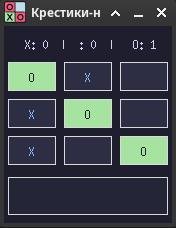

# ❌ Крестики-Нолики (Dark Mode) ⭕

Стильная, адаптивная и кроссплатформенная десктопная игра **Крестики-Нолики** (Tic-Tac-Toe), написанная на Python с использованием библиотеки `Tkinter` и современного менеджера пакетов `uv`.

## ✨ Особенности проекта

- **Современная тёмная тема:** Элегантная графитовая палитра, приятная для глаз.
- **Интерактивный интерфейс:** Плавный эффект подсвечивания (hover) кнопок при наведении мыши и жирные, контрастные шрифты (`Ubuntu` / `DejaVu Sans`).
- **Умный счётчик матчей:** Панель сверху ведет учет побед игрока X, игрока O и ничьих, сохраняя историю на протяжении всей игровой сессии.
- **Блокировка поля:** После определения победителя сетка автоматически блокируется для кликов до нажатия кнопки «Новая игра».
- **Кроссплатформенность:** Оптимизировано для Linux, Windows и macOS (используются PNG-иконки для защиты от падений графического движка Tcl/Tk в Linux).

## 🛠️ Требования к системе

- **Python** версии 3.12 или новее
- **uv** (быстрая альтернатива pip для управления проектами)

## 🚀 Установка и запуск (Локально)

1. **Клонируйте репозиторий к себе на компьютер:**

   ```bash
   git clone https://github.com
   cd tic-tac-toe
   ```

2. **Запустите игру одной командой с помощью `uv`:**
   ```bash
   uv run main.py
   ```

## 🐳 Мгновенный запуск через Docker (GitHub Packages)

Вы можете запустить игру одной командой на Linux без скачивания исходного кода и настройки окружения. Готовый скомпилированный образ автоматически загрузится из реестра GitHub:

```bash
# 1. Разрешаем локальным Docker-контейнерам доступ к вашему экрану
xhost +local:docker

# 2. Скачиваем образ и запускаем графическое окно игры
docker run -it --rm \
  -e DISPLAY=\$DISPLAY \
  -v /tmp/.X11-unix:/tmp/.X11-unix \
  ghcr.io/als-creator/tic-tac-toe:latest
```

## 🎨 Скриншоты



## 📝 Лицензия
